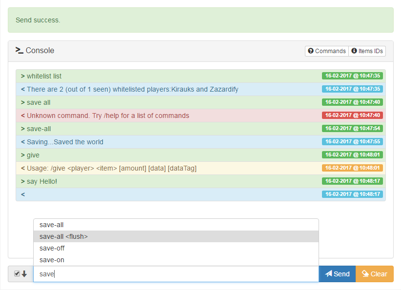
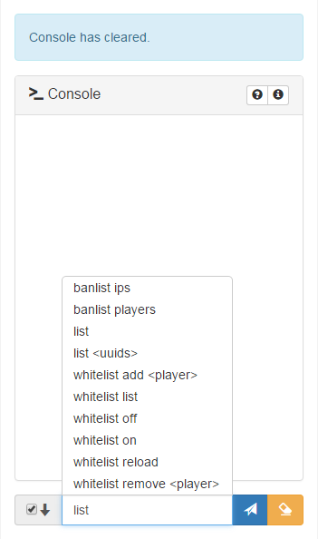

# Minecraft-RCON
Simple Web Console de Minecraft RCON (en utilisant PHP, Bootstrap et Javascript)

Inspiré par [Minecraft-RCON-Console](https://github.com/ekaomk/Minecraft-RCON-Console) et en utilisant [PHP-Minecraft-Rcon](https://github.com/thedudeguy/PHP-Minecraft-Rcon).





## Configuration

1. Modifier votre `server.properties` fichier de configuration pour ACTIVER RCON:
```
enable-rcon=true
rcon.port=25575 (Laisser le port par defaut)
rcon.password=Mettre un mot de passe
```
2. Redémarrer votre serveur.
3. Téléchargez / clonez les fichiers de la console Web Minecraft RCON et éditez le fichier `config.php`. Utilisez le même mot de passe et le même port rcon que celui défini dans `server.properties`:
```
$rconHost = "localhost";
$rconPort = port définie sur server.properties;
$rconPassword = "Mot de passe définie sur server.properties";
```

## Warnings

* Provided as it is, **this console has no authentication check**, so anybody with access to this console can run any commands on the Minecraft server. Please check at least the documentations below, about how to setup some basic http authentification on your web server, in order to restrict the access to the console:
 * [For Apache 2.4 users](https://httpd.apache.org/docs/2.4/howto/auth.html)
 * [For NGinx users](https://nginx.org/en/docs/http/ngx_http_auth_basic_module.html)
* Use a strong custom random RCON password (change the default one provided here) for more security.
* Set up your firewall in order to allow only the web server to communicate with the Minecraft server through the RCON port set, for more security.


